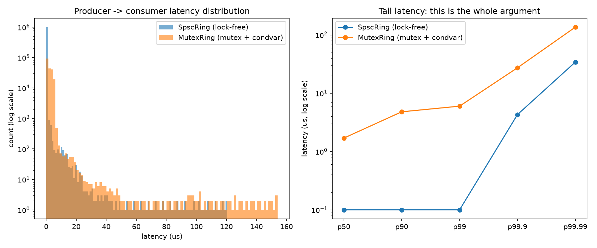

# spsc-latency-lab

A lock-free single-producer/single-consumer ring buffer in C++20, benchmarked head-to-head against a mutex + condition_variable queue on the metric that actually matters: tail latency, not average latency.

## Why this exists

Citadel Securities has a [recruiting post](https://www.citadelsecurities.com/careers/career-perspectives/why-cpp-wins-in-finance/) arguing that C++ wins in finance because it gives deterministic, predictable performance under extreme latency constraints: no GC pauses, direct control over memory and hardware, "what's compiled is what runs." The claim: predictability in the worst case matters more than speed on average, because if you miss your window by nanoseconds, someone else gets the fill.

That's a testable claim. This repo tests it, at a scale anyone can run on their own machine.

Two queues, same job. Hand a message from a producer thread to a consumer thread:

- **`SpscRing`**: lock-free, fixed-capacity, zero allocation after construction, zero syscalls in the hot path. Cache-line-padded indices so producer and consumer never fight over the same cache line.
- **`MutexRing`**: `std::mutex` + `std::condition_variable` + `std::deque`. The thing everyone reaches for first. Also correct. Also allocates, locks, and depends on the OS scheduler to wake the consumer back up.

The benchmark sends timestamped messages at a fixed rate and measures producer-to-consumer latency end to end, then reports p50 through p99.99 and max, not just the mean. The averages for both queues usually look fine. The tails are where the argument actually lives.

## Design

```
head_ (atomic, producer writes) ---> own cache line
cached_tail_ (producer-private)  /

tail_ (atomic, consumer writes) ---> own cache line
cached_head_ (consumer-private)  /

buffer_[Capacity]                ---> own cache line(s)
```

Each thread keeps a private cached copy of the *other* thread's index and only re-reads the real atomic when the ring looks full or empty. Without that, every single push/pop would touch a cache line the other thread is writing to, turning every operation into a cross-core cache miss, which is a fine way to build a "lock-free" queue that's still slow. This pattern is standard (boost::lockfree::spsc_queue and the LMAX Disruptor both do a version of it); the header is small enough to read start to finish and see why it's correct.

Correctness rests entirely on the fact that there is exactly **one** producer and **one** consumer thread. `head_`'s release store synchronizes-with the consumer's acquire load of it, so a buffer write is guaranteed visible before the consumer reads that slot. Same relationship in reverse for `tail_`. That's it: no CAS loops, because with a single writer per index there's nothing to compete for.

## Build

Requires a C++20 compiler and CMake 3.16+.

```
cmake -B build -DCMAKE_BUILD_TYPE=Release
cmake --build build --config Release
```

## Run

```
ctest --test-dir build              # correctness: ordering, wraparound, full/empty, 1M-message concurrent run
./build/bench_latency                # or build\Release\bench_latency.exe on Windows
python -m pip install -r requirements.txt
python benchmarks/plot_latency.py    # renders benchmarks/results/latency_comparison.png
```

`bench_latency` takes optional args: `bench_latency [lockfree_message_count] [mutex_message_count] [send_interval_ns]`. Defaults send one message per microsecond: 1M messages through the lock-free ring, 200k through the mutex ring (condition_variable wakeups make that run take meaningfully longer for the same count).

Run it from the repo root; the CSV output paths in `bench_latency.cpp` are relative to `benchmarks/results/`.

## Results

Measured on a shared/virtualized Windows host (12 logical processors, not dedicated hardware), 1M messages through the lock-free ring and 200k through the mutex ring, one message per microsecond. Take the absolute numbers with a grain of salt (they're a VM, not a colo cage), but the shape is the interesting part.

**First attempt, default thread priority:**

| percentile | SpscRing (lock-free) | MutexRing (mutex + condvar) |
|---|---|---|
| p50 | 100 ns | 1,700 ns |
| p99 | 4,100 ns | 6,000 ns |
| p99.9 | 559,200 ns | 30,200 ns |
| p99.99 | 1,132,600 ns | 80,100 ns |

The median told the expected story: the lock-free ring is ~17x faster typically. The tail told the *opposite* story: the "deterministic" lock-free queue had a worse p99.9 than the queue that locks, allocates, and asks the OS to wake it up. Re-running it made this worse, not better (p99.9 hit 1.27ms on a second run), while the mutex baseline's tail also swung around by 10x run to run. That's not two algorithms behaving differently. That's both threads occasionally getting starved of CPU by something outside the program, most likely the hypervisor scheduling this VM's vCPUs against other tenants on the host.

**After pinning affinity *and* raising thread priority** (`SetThreadPriority(..., THREAD_PRIORITY_TIME_CRITICAL)` + `SetPriorityClass(..., HIGH_PRIORITY_CLASS)`, both added to `bench_latency.cpp` after the first result looked wrong):

| percentile | SpscRing (lock-free) | MutexRing (mutex + condvar) |
|---|---|---|
| p50 | 100 ns | 1,700 ns |
| p99 | 100 ns | 6,000 ns |
| p99.9 | 4,300 ns | 27,300 ns |
| p99.99 | 34,200 ns | 135,800 ns |
| max | 120,600 ns | 154,200 ns |

Once the scheduler was told these threads actually mattered, the lock-free ring won at every percentile, reproducibly across repeated runs, and the tail gap widened rather than shrank, exactly what the underlying design predicts.

This is arguably a better demonstration of the article's actual point than a clean win on the first try would have been: a lock-free algorithm removes one source of nondeterminism (locking, allocation, OS wakeup latency), but it doesn't remove *all* of them. If something else (a hypervisor, a noisy neighbor process, a scheduler that doesn't know your thread is latency-critical) can still steal the CPU out from under you, the "deterministic" queue is only as deterministic as the environment you handed it. This is precisely why real trading infrastructure goes further than "write it in C++": dedicated bare-metal hosts, isolated cores (`isolcpus`/`taskset`), disabled frequency scaling, and kernel-bypass networking all exist to remove exactly this kind of external jitter. The algorithm is necessary; on its own, it isn't sufficient.



## Limitations

- This measures memory-to-memory latency between two threads on one machine. It says nothing about network I/O, kernel-bypass NICs, or the FPGA-based execution paths the fastest real trading systems use for the final leg. C++ (or a lock-free algorithm in general) wins the software-control layer, not the entire latency budget.
- `std::chrono::steady_clock` resolution (backed by `QueryPerformanceCounter` on Windows) is good to roughly 100ns, which is fine for seeing the mutex-vs-lock-free gap but not for measuring sub-100ns effects.
- Core-affinity pinning reduces scheduler jitter but a non-real-time OS can still preempt either thread; absolute numbers will vary run to run and machine to machine. The *relative* comparison (lock-free vs mutex, mean vs tail) is the point, not any single number.
- `MutexRing` is an intentionally naive baseline, not a tuned one. A real mutex-based queue could close some of the gap; that's not really the point either. The argument is about the failure mode (allocation, locking, OS wakeup latency) inherent to that approach, not about how fast a mutex can be made.
